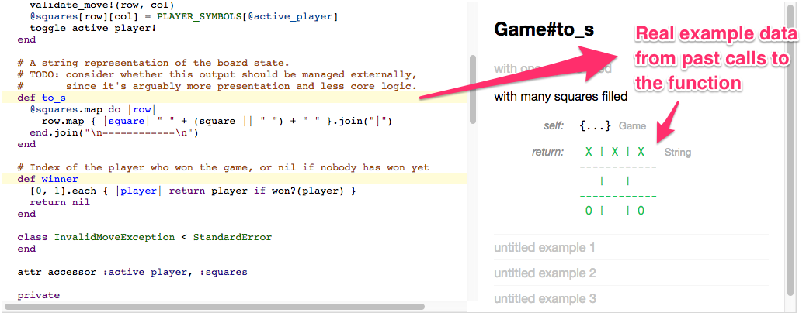

# Margin Notes

Programmers working on large codebases frequently need to understand APIs for existing code. Manual documentation is helpful, but takes time to maintain and often doesn’t include enough examples.

Margin Notes automatically generates code documentation by recording example data from function calls as a program executes and displaying those examples in an interactive UI next to the code. This allows programmers to quickly view many examples from past executions as they read the code, helping them efficiently gain insight into the behavior of the program.

This repo contains the code for the frontend user interface,
which is embedded in an interactive essay.

* [Read the full interactive essay](https://geoffreylitt.com/margin-notes/)
* See the code for the example recording backend: [Ruby example recorder](https://github.com/geoffreylitt/example-recorder)

## Development

* To run locally : `npm run dev`
* To deploy: `./deploy.sh`
